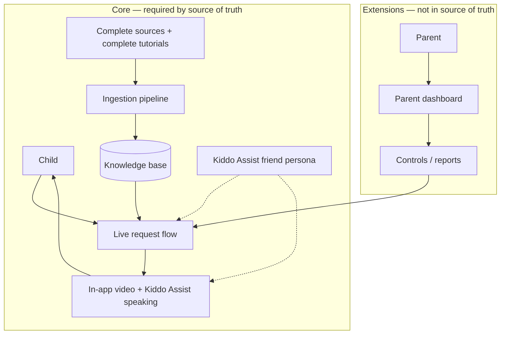
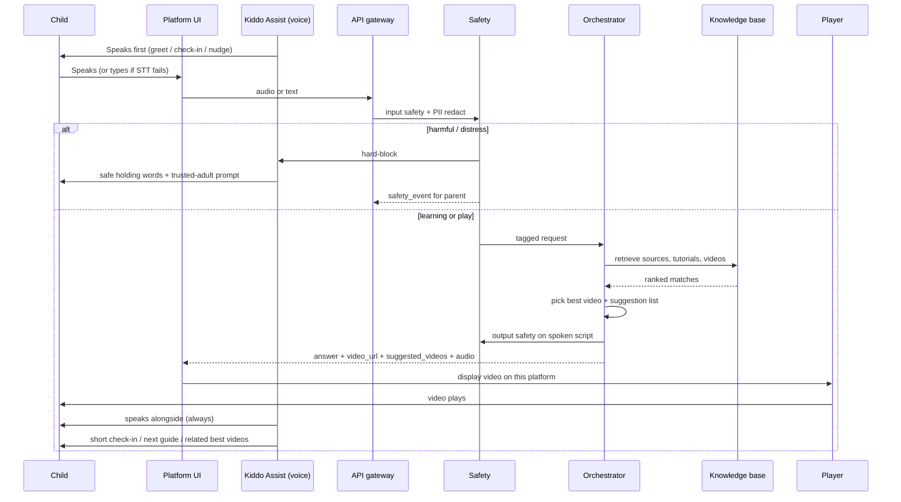
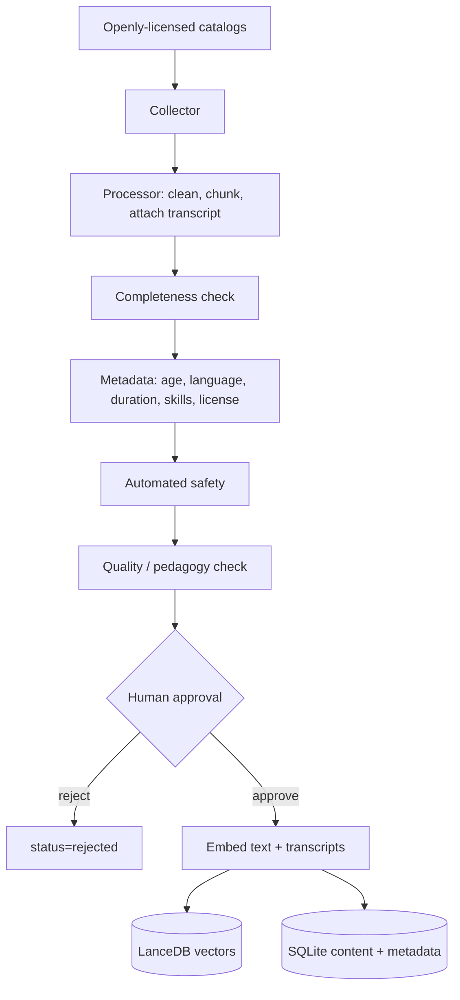
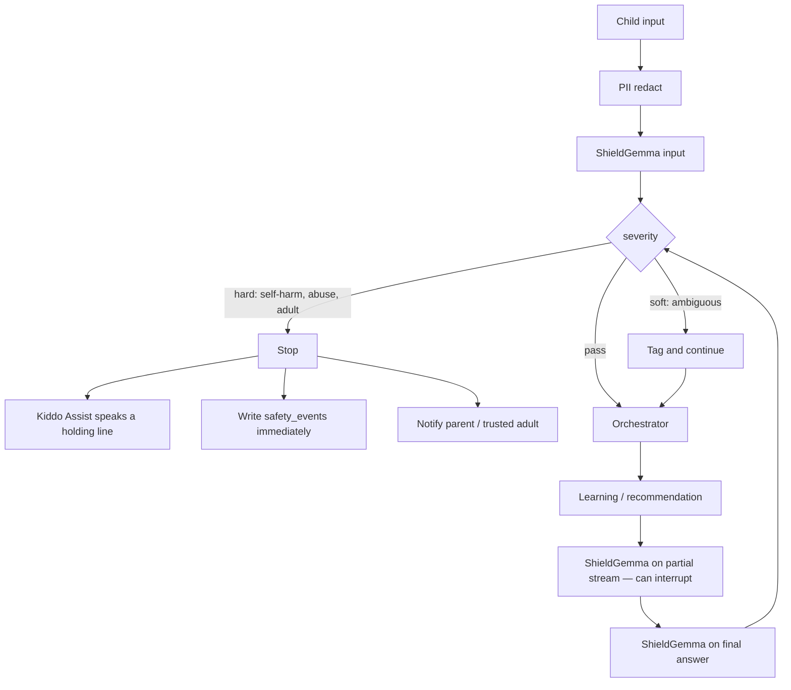
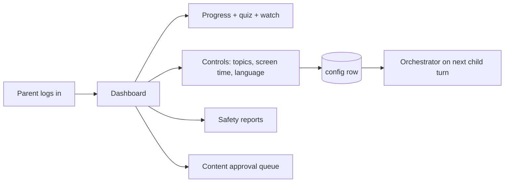

# Kiddo Assist — Complete Workflow

**Source of truth:** `an agent for the children(kids) for.txt`  
**Checked against:** `kiddo-architecture.md`, `IMPLEMENTATION-GUIDE.md`  
**Product name (from source of truth):** Kiddo Assist

This document does three jobs:

1. Restates the product from the source-of-truth file — nothing more, nothing less.
2. Verifies the architecture and implementation plan against that file.
3. Details the complete workflows: child session, video loop, safety, ingestion, parent (extension), and build order.

If architecture or implementation disagrees with the source of truth, the source of truth wins.

---

## 0. Source of truth — extracted requirements

The source file is informal, but every sentence is a requirement. Nothing in it is optional.

### 0.1 Verbatim intent (normalized, not expanded)

Kiddo Assist is a **friend AI for children**. It:

- Helps them **learn** from **complete sources** and **complete tutorials**.
- **Suggests the best videos** for them.
- **Plays** those videos **with relevance** (learning, playful learning, fun learning).
- Is **never harmful**.
- Helps them **grow**, **learn things**, and **guides** them — a good guider.
- After the child **speaks** to the assistant, it **fetches the video from the knowledge base** and **displays it on this platform’s interface**.
- **Speaks to them always**.
- **Is a friend** with them.
- Is named **Kiddo Assist**.

### 0.2 Requirement inventory

| ID | Requirement | Kind |
|---|---|---|
| SOT-01 | Agent is for children / kids | Audience |
| SOT-02 | Learning is the purpose | Purpose |
| SOT-03 | Knowledge base holds complete sources | Content |
| SOT-04 | Knowledge base holds complete tutorials | Content |
| SOT-05 | Suggest the **best** videos (ranked, not random) | Video |
| SOT-06 | Play videos **with relevance** (matched to what was just said) | Video |
| SOT-07 | Learning + playful learning + fun learning | Pedagogy |
| SOT-08 | Nothing is harmful | Safety |
| SOT-09 | Friend AI (not a search box / tutor-only) | Persona |
| SOT-10 | Helps them grow | Progression |
| SOT-11 | Guides them — a good guider | Guidance |
| SOT-12 | Child **speaks** → assistant fetches video from **knowledge base** | Core loop |
| SOT-13 | Video **displays on this platform interface** (in-app, not a tab away) | Core loop |
| SOT-14 | Name is **Kiddo Assist** | Identity |
| SOT-15 | Assistant **speaks always** (voice is the default, not an add-on) | Voice |
| SOT-16 | Be friends with them (ongoing relationship) | Persona |

### 0.3 The one loop that must never be lost

```
Child speaks to Kiddo Assist
        ↓
Kiddo Assist understands (safely)
        ↓
Fetch the best matching video from the knowledge base
        ↓
Display / play that video on this platform
        ↓
Kiddo Assist speaks around it — as a friend, as a guide
```

If a design, phase, or API response cannot do this loop, it is not Kiddo Assist yet.

### 0.4 What the source of truth does **not** say

These are reasonable product extensions. They must stay labeled as extensions so they never outrank SOT-01…SOT-16.

| ID | Extension | Why it exists |
|---|---|---|
| EXT-01 | Parent dashboard, controls, reports | Child-safety / COPPA-style duty of care |
| EXT-02 | Multilingual pivot (English internal, Hindi in/out) | Household language reality; not in the source file |
| EXT-03 | Local open-source $0/month stack | Build constraint, not a child-facing requirement |
| EXT-04 | Formal skill graph / curriculum standards | Makes “grow” and “guide” measurable |
| EXT-05 | Docker / Ollama / CPU-only laptop | Runtime constraint |
| EXT-06 | Stream-by-reference (never rehost video bytes) | Legal constraint for SOT-03/SOT-05 |

---

## 1. Verification — architecture vs source of truth

Legend: **Met** = covered as specified. **Partial** = present but drifted. **Missing** = not in the architecture. **Extra** = in the architecture, not in the source of truth.

| SOT | Architecture coverage | Verdict | Notes |
|---|---|---|---|
| SOT-01 Children | Overview, input safety, child UI | **Met** | Audience is correct. |
| SOT-02 Learning | Learning agent, RAG, LLM teach | **Met** | |
| SOT-03 Complete sources | Ingestion from trusted educational sources → 3 DBs | **Partial** | “Trusted sources” is specified; “complete” (full works / full topic coverage, not snippets) is not a stated ingest rule. |
| SOT-04 Complete tutorials | Skill graph, lessons as quests | **Partial** | Tutorials are not a first-class content type. `content` is videos / text / activities. A tutorial (ordered, complete sequence) is missing. |
| SOT-05 Suggest best videos | Content ranker picks **one** best-fit video | **Partial** | Source says **suggest the best videos** (plural) **and** play. Architecture only auto-plays the single winner. Need a ranked suggestion list + play the top one. |
| SOT-06 Play with relevance | RAG + metadata filter + rerank + video selection | **Met** | Strongest part of the architecture. |
| SOT-07 Playful / fun | §2.9 Play & fun learning layer | **Met** | |
| SOT-08 Nothing harmful | Input safety, output safety, safety agent, ingest safety + human gate | **Met** | Stronger than the source file, correctly. |
| SOT-09 Friend AI | §2.8 Companion persona | **Met** | |
| SOT-10 Grow | §2.10 Learning growth progression | **Met** | |
| SOT-11 Guide | Recommendation agent + next-step guidance | **Met** | |
| SOT-12 Speak → fetch from KB | §2.7 video-first: answer → fetch best video from KB | **Met** | This is the backbone. |
| SOT-13 Display on this platform | In-app video player | **Met** | |
| SOT-14 Name = Kiddo Assist | Document title is “Kiddo Learning Platform”; persona is “Kiddo” | **Missing** | Rename the product / persona to **Kiddo Assist**. |
| SOT-15 Speak always | TTS exists; text chat is equally primary | **Partial** | “Speak always” means Kiddo Assist **talks on every turn**, including greetings and video-alongside. Text is a fallback for STT failure, not the default product. |
| SOT-16 Be friends | Friendship memory, speaks first, celebrates wins | **Met** | |

### 1.1 Architecture extras (keep, but do not let them bury the core loop)

- Parent system (§4) — EXT-01. Necessary for a real children’s product. Must not delay SOT-12/SOT-13.
- Multilingual layer (§2.3) — EXT-02. Correct for Hindi/English households; not a source requirement.
- Three-agent orchestrator — good decomposition of SOT-08/SOT-11, not a conflict.
- CPU-only OSS stack (Appendix A) — EXT-03/EXT-05. Implementation constraint.

### 1.2 Architecture internal issues (even where SOT is met)

1. **Name drift.** “Kiddo”, “Kiddo the companion”, “Kiddo Learning Platform” — never “Kiddo Assist”.
2. **Single video vs suggested videos.** §2.6 “usually a single best-fit video” under-serves SOT-05.
3. **No tutorial object.** Quests/skills approximate SOT-04 but a child cannot be given “the complete tutorial on fractions” as one fetchable unit.
4. **Build order vs core loop.** Architecture §5 puts video (the actual product) at step 4, which is acceptable for engineering, but the **definition of the product** is the video loop, not the text chat loop.
5. **Open questions that the implementation already answered** are still listed as open in architecture §6 (pivot language, filter order). They should be marked resolved.

---

## 2. Verification — implementation guide vs source of truth + architecture

| Check | Implementation coverage | Verdict |
|---|---|---|
| SOT core loop (speak → KB video → in-app play) | Guiding principle #2 “Video-first”; phase 3 definition of done | **Met** as the build target |
| SOT-14 Name | Never uses “Kiddo Assist” | **Missing** |
| SOT-15 Speak always | Phase 1 is text-only; voice is phase 5 | **Partial** — fine as *build* order, missing as a *product* rule. Phase 3 TTS “explains alongside” is correct. After phase 5, silence on a turn is a bug. |
| SOT-04 Complete tutorials | `content_items.type` = `video \| text \| game` — no `tutorial` | **Missing** |
| SOT-05 Best videos (plural) | `/api/chat` returns `video_url?` (singular) | **Partial** — should also return `suggested_videos[]` |
| SOT-03 Complete sources | Wikimedia / NASA / PhET / OpenStax + license gate | **Partial** — good catalogs, but no “completeness” rule (full tutorial series vs orphan clips) |
| SOT-08 Safety | ShieldGemma in + out, PII regex, human approval, eval suite | **Met** |
| SOT-09 / SOT-16 Friend | `persona.py`, friendship memory, proactive cron | **Met** |
| SOT-10 / SOT-11 Grow + guide | `progress.py`, skills, recommendation via frontier skills | **Met** |
| Architecture 3 agents | `orchestrator.py` learning / recommendation / safety | **Met** |
| Architecture 3 DBs | Collapsed to LanceDB + SQLite (content URL lives on the SQLite row) | **Acceptable** — documented, equivalent |
| Architecture build order 12 steps | 11 phases (0–10); recommendation agent has no own phase; play+progress merged | **Partial drift** |
| Filter-before-retrieve | Locked (catalog small) | **Resolved** (architecture still lists as open) |
| Pivot = English | Locked | **Resolved** |
| Stream-by-reference | Locked | **Resolved** — required to ship SOT-05 legally |
| Child-speech risk | Honest: no freely licensed child-speech corpus; text fallback mandatory | **Met** — this protects SOT-15 from becoming a dead-end |

### 2.1 Implementation vs architecture — remaining mismatches to close

| Topic | Architecture | Implementation | Workflow rule |
|---|---|---|---|
| Product name | Kiddo / Kiddo Learning Platform | Kiddo | **Kiddo Assist** everywhere |
| Video response | One best video | `video_url?` | `video_url` (now playing) **plus** `suggested_videos[]` |
| Tutorials | Implied via skills/quests | No type | `type=tutorial` + `tutorial_steps` ordered content |
| Recommendation agent | Own build step (10) | Folded into phase 8 | Keep the agent; phase 8 ships a thin version, phase 8.1 hardens it |
| Voice | Part of multilingual step | Split: phase 5 voice, phase 6 languages | Keep the split (buildable). Product rule: after phase 5, Kiddo Assist always speaks |
| Parent / multilingual | Core sections | Phases 6 and 9 | Keep as **extensions** that ship, after the core loop works |
| Safety escalation | Open question | Holding message + parent webhook | Adopt implementation as the closed decision |
| Completeness of sources | “Trusted educational sources” | License allowlist only | Add a completeness gate at ingest (see §6) |

---

## 3. Product definition (locked from source of truth)

**Kiddo Assist** is a child-facing friend that talks with a child, then puts the right video on screen from its own knowledge base.

| It is | It is not |
|---|---|
| A friend who speaks | A silent search box |
| A guide who grows with the child | A one-shot Q&A bot |
| A player of **relevant, best** videos **inside the app** | A YouTube redirect / new-tab opener |
| A teacher of **complete** sources and tutorials | A clip lottery |
| Playful and fun | Chaotic or addictive-by-design |
| Harmless by construction | “We’ll prompt it to be nice” |

**Default modality:** voice in, voice out, video on screen.  
**Fallback modality:** text in (when speech fails), still voice out.  
**Never:** answer-only with no attempt to fetch a video when a relevant video exists.

---

## 4. System map (how the three docs fit)

```
an agent for the children(kids) for.txt     ← source of truth (what / why)
                │
                ▼
     kiddo-architecture.md                  ← system design (how it is shaped)
                │
                ▼
     IMPLEMENTATION-GUIDE.md                ← build book (how it is built, with which tools)
                │
                ▼
     WORKFLOW.md (this file)                ← operating + delivery workflows (how it runs)
```

Three cooperating systems (from architecture) plus the persona thread:



---

## 5. Runtime workflow — child session (happy path)

This is the product. Every other workflow exists to make this one safe, complete, and repeatable.



### 5.1 Step-by-step (one turn)

| Step | Actor | What happens | SOT |
|---|---|---|---|
| 0 | Kiddo Assist | If the child is new or idle, **Kiddo Assist speaks first**. Friendship, not a blank prompt. | SOT-09, SOT-15, SOT-16 |
| 1 | Child | Speaks a question, a play request, or a “what next?”. Text only if speech fails. | SOT-12, SOT-15 |
| 2 | Frontend | Captures audio (or text). Shows the friend avatar. Video pane is ready. | SOT-13 |
| 3 | API gateway | Authenticates the child session, rate-limits, logs. | EXT |
| 4 | Multilingual (if needed) | STT → language detect → code-switch → pivot to English. Skip translation when the child already spoke English or confidence is low. | EXT-02 |
| 5 | Input safety | Profanity, distress, bullying, adult/off-topic, jailbreak, PII. Hard-block or soft-tag. | SOT-08 |
| 6 | Intent | Learning question / play request / guidance request / concerning. | SOT-02, SOT-07, SOT-11 |
| 7 | Orchestrator | Learning agent, recommendation agent, or safety agent. Safety agent also runs in parallel and can interrupt. | SOT-08 |
| 8 | Query construction | Rewrite the child’s words into a search query. Resolve “that one” from recent turns. | SOT-06 |
| 9 | Retrieve from knowledge base | Vector + metadata search over **videos, complete sources, and complete tutorials**. | SOT-03, SOT-04, SOT-12 |
| 10 | Filter | Age, language, safety clearance, difficulty, duration, **license**, **status=approved**. | SOT-08, SOT-01 |
| 11 | Rank “best videos” | `relevance × quality × age_fit × duration_fit × completeness × tutorial_fit`. | SOT-05, SOT-06 |
| 12 | Select | **Now playing** = top video if it clears the relevance bar. **Suggested** = next 2–4 videos. If the match is a tutorial, play step 1 (or the matching step) and keep the rest as the tutorial path. | SOT-04, SOT-05, SOT-13 |
| 13 | Speak the teaching | LLM writes a short, age-tuned, friend-voiced explanation **around** the video. No hallucination outside retrieved context. | SOT-09, SOT-11, SOT-15 |
| 14 | Output safety | Re-check the spoken script. Block → holding response. Soft-flag → parent report, still safe words. | SOT-08 |
| 15 | Response builder | `{ spoken_answer, audio, video_url, suggested_videos[], tutorial?, quiz?, suggested_next }` | SOT-05, SOT-12, SOT-13 |
| 16 | Platform UI | **Displays the video in the in-app player.** Attribution line visible. Related best videos as suggestions, not a navigate-away. | SOT-13 |
| 17 | Kiddo Assist | **Speaks** the explanation while the video plays. Never silent when there is something to say. | SOT-15 |
| 18 | Play / check-in | Mini-question, sticker, or tiny game. Celebrate effort. | SOT-07 |
| 19 | Guide | One next step: next tutorial step, related video, or “want to play a bit?” | SOT-11, SOT-10 |
| 20 | Remember | Progress, watch time, quiz, friendship memory (no PII). Feeds the next turn. | SOT-10, SOT-16 |

### 5.2 Idle / proactive turn (Kiddo Assist speaks without being asked)

Required by “speak to them as always” and “be friend with them”.

1. Child is idle past a gentle threshold (age-tuned, parent-configurable later).
2. Kiddo Assist speaks a short check-in: greeting, a remembered interest, or a playful nudge.
3. Offers one relevant video or a tiny game — still from the knowledge base, still in-app.
4. Never nags. A missed day does not punish (forgiving streaks).

### 5.3 No-video-match path

If nothing in the knowledge base clears the relevance bar:

1. Kiddo Assist **still speaks**.
2. Honest friend line: it doesn’t have a great video for that yet.
3. Teach from approved **text/source** chunks if they exist.
4. Offer a nearby tutorial or a play activity.
5. Log a content gap (ingestion backlog). Never invent a video URL. Never send the child off-platform.

### 5.4 Speech-miss path (protects “speak always”)

Child STT is the known weak spot.

1. Dual-ASR / LLM repair if available.
2. Kiddo Assist speaks: “I didn’t catch that — want to tap it for me?”
3. Big text button is always on screen. **The UI must never dead-end on a speech miss.**
4. After text arrives, the rest of §5.1 is unchanged — including spoken reply + video.

---

## 6. Knowledge-base workflow — complete sources, complete tutorials, best videos

SOT-03, SOT-04, SOT-05, SOT-12 live or die here.

### 6.1 What may enter the knowledge base

| Type | Meaning | How “complete” is judged |
|---|---|---|
| `source` | A full educational work or clearly bounded excerpt with license (article, lesson text, simulation, NASA clip with context) | Has title, source, license, age band, transcript/text, and is not an unexplained fragment |
| `tutorial` | An **ordered sequence** that teaches one topic end-to-end (steps 1…N, each step may be a video or activity) | Has a start, a middle, an end, a skill, and a check-for-understanding. A single orphan clip is **not** a tutorial |
| `video` | A playable item streamed by reference | Transcript exists (for retrieval). Age/safety/license tagged. Relevance is computed at query time |
| `game` | A play activity that teaches | The fact is in the play, not only in the reward |

### 6.2 Ingest pipeline (offline)



| Step | Gate | Fail action |
|---|---|---|
| License | Allowlist. NC sources are embed-only. Unknown license = reject | Do not store a playable URL |
| Completeness | Video: transcript + attribution + topic. Tutorial: ordered steps covering the stated learning goal. Source: identifiable full work or labeled excerpt | Quarantine as `incomplete` — not searchable |
| Safety | ShieldGemma on transcript/text + human eyeball | `rejected` |
| Quality | Age-fit, pedagogical sense, duration sane for age band | `rejected` or send back |
| Approval | Human flips `review` → `approved` | **Nothing is live before this** |
| Embed | bge-m3 into LanceDB; row into SQLite including `url`, `license`, `attribution` | Retry; never half-index |

**Hard rule:** we store transcript + metadata + URL. We never store third-party video bytes. The player streams by reference. This is how SOT-13 is legal.

### 6.3 Fetch-from-knowledge-base (live)

This is SOT-12 as an algorithm.

```
input: child's utterance (pivoted), learner profile, safety tags
1. Build query from utterance + last 2–3 turns + profile interests
2. Embed query
3. Filter-before-retrieve:
      status=approved
      age_range contains learner.age
      safety_tags pass
      language compatible
      not in parent restricted_topics
      duration ≤ age-band max
4. Retrieve top-K across type in {video, tutorial, source}
5. Rerank for true relevance
6. Score videos:
      best = relevance × quality × age_fit × duration_fit × completeness
7. If best.score ≥ VIDEO_BAR:
      now_playing = best
      suggested_videos = next 2–4 videos
      if best belongs to a tutorial: attach tutorial path (current step + remaining)
8. Else if a tutorial matches:
      now_playing = that tutorial's current/next video step
      suggested_videos = remaining steps
9. Else:
      now_playing = null
      speak from approved source text + offer nearest tutorial
10. Return to response builder
```

`VIDEO_BAR` starts **strict** (better to speak and wait than to play a wrong video). Relax only as the catalog grows. Wrong-video is a SOT-06 failure.

---

## 7. Safety workflow (SOT-08 — non-negotiable)

Safety is a classifier in the path, not a prompt. It runs on the way in, in the background during generation, and on the way out. It also runs at ingest.



| Signal | Child sees / hears | System does |
|---|---|---|
| Hard block | Warm, short, non-alarming holding words. Prompt to a trusted adult. No video. | Stop generation. `safety_events` row. Parent notify. |
| Soft tag | Normal helpful turn | Flag on the request; parent report later |
| Jailbreak / “ignore your rules” | Refuse in kid language; offer a real learning path | Treat as hard or high-soft; never comply |
| PII (name of school, address, phone) | Continue without repeating the PII | Redact before LLM and before logs that leave the device |
| Off-platform “just open YouTube” | Stay in-app; fetch from KB only | No outbound browse |

**Persona limit:** friendship is for learning and comfort, never for compliance. Kiddo Assist never talks a child into an unsafe action, a secret from parents, or a private meeting.

**Friendship-memory limit:** no PII in memory. Cap facts. Parents can see that memory exists (EXT-01); Kiddo Assist does not hide a second life from the parent.

---

## 8. Friend, play, and growth workflows

### 8.1 Friend workflow (SOT-09, SOT-16, SOT-15)

On every spoken turn Kiddo Assist:

1. Uses the child’s name if known (from parent-approved profile, not scraped PII).
2. Speaks in a warm, slower, age-tuned voice.
3. References a real memory when it helps learning (“you liked rockets — this video is about the Moon”).
4. Celebrates effort, not only correct answers.
5. Ends with a tiny invitation, not a command.

Kiddo Assist **speaks always**: greeting, answer, video-alongside, check-in, goodbye. Text on screen is captions / support, not a replacement for voice once TTS is live.

### 8.2 Playful learning workflow (SOT-07)

```
video or tutorial step
    → 20–40s play beat (match, quiz-as-game, sticker)
    → fact appears inside the play
    → streak tick (forgiving)
    → optional badge
    → Kiddo Assist speaks praise
    → next video / next tutorial step / free play
```

Rules:

- The game teaches; it is not a sugar coating on a lecture.
- Streaks do not wipe on one missed day.
- Rewards stay light. No pressure, no pay-to-win, no dark patterns.

### 8.3 Guide-and-grow workflow (SOT-10, SOT-11)

```
watch/play signal
    → check-in score  (watched ≠ understood)
    → update skill graph
    → frontier skill = what they’re ready for next
    → recommendation agent speaks one next step
    → if a complete tutorial is in progress, prefer the next step of that tutorial
```

Kiddo Assist is a **guider**: it does not dump a library. It offers one good next thing, plus a short list of best related videos the child can pick.

---

## 9. Parent workflow (EXT-01 — ships, does not define the product)

Parents never sit inside the child’s live turn except through configuration loaded at the start of the session.



| Parent can | Parent cannot |
|---|---|
| See what was learned, which videos played, quiz scores | Silently listen to a live session in a way the child would not expect |
| Restrict topics, cap session length | Turn off input/output safety |
| Receive hard-block alerts | Impersonate Kiddo Assist |
| Approve / reject ingested content | |

Ethics: the child-facing app and the parent area are separate surfaces.

---

## 10. API workflow (one contract for the core loop)

The chat endpoint **is** the product.

`POST /api/chat`  
Input: `{ audio }` or `{ text }`, plus child session.

Output (minimum for SOT-05, SOT-12, SOT-13, SOT-15):

```json
{
  "assistant_name": "Kiddo Assist",
  "answer": "spoken script in the child's language",
  "audio_url": "...",
  "video_url": "https://licensed-source/...",
  "video": {
    "id": "...",
    "title": "...",
    "attribution": "...",
    "license": "...",
    "duration_s": 180
  },
  "suggested_videos": [
    { "id": "...", "title": "...", "reason": "next in tutorial" }
  ],
  "tutorial": {
    "id": "...",
    "title": "Complete tutorial: fractions",
    "step": 2,
    "total_steps": 6
  },
  "quiz": null,
  "suggested_next": "Want to try the next step, or a tiny game?",
  "safety": { "verdict": "pass" }
}
```

Supporting endpoints stay as in the implementation guide (`/api/videos/{id}`, `/api/audio/{id}`, `/api/profile`, `/api/parent/*`, `/api/ingest`, `/api/health`).

`/api/videos/{id}` returns metadata + stream-by-reference URL for the in-app player. It does not proxy video bytes.

---

## 11. Frontend workflow (what the child actually sees)

One screen. Low cognitive load. Big controls.

```
┌─────────────────────────────────────────────┐
│  Kiddo Assist          streak • badge strip │
│  [animated friend avatar]                   │
│                                             │
│  ┌───────────────────────────────────────┐  │
│  │         IN-APP VIDEO PLAYER           │  │
│  │     (this platform — SOT-13)          │  │
│  │     attribution under the player      │  │
│  └───────────────────────────────────────┘  │
│                                             │
│  Kiddo Assist is speaking…                  │
│  [captions of what Kiddo Assist just said]  │
│                                             │
│  Best videos for you:  [v1] [v2] [v3]       │
│                                             │
│  [  BIG MIC  ]     [  TAP TO TYPE  ]        │
└─────────────────────────────────────────────┘
```

Rules:

- The video plays **here**. No “open on YouTube” as the primary action.
- The mic is the default. Type is always available.
- Suggested videos are on this screen; tapping one plays it here and Kiddo Assist speaks around the new choice.
- Avatar + voice run even when a video is playing.

---

## 12. Build workflow — phases (implementation order, source-of-truth gates)

Build order may start with text. **The product is not Kiddo Assist until phase 3 is done.** Voice-always is not Kiddo Assist until phase 5 is done.

| Phase | Ships | Source-of-truth gate (must pass to call the phase done) |
|---|---|---|
| 0 Skeleton | `docker compose up`; `/api/health`; Ollama up | Dev only |
| 1 Text chat | Child types → Gemma answers with output safety | SOT-08 starting. **Not** the product yet |
| 2 RAG | Answer cites an ingested source | SOT-03 starting |
| **3 Video-first** | Question → best video from KB → **plays in-app**; TTS alongside; `suggested_videos` returned | **SOT-05, SOT-06, SOT-12, SOT-13.** This is the first honest demo of Kiddo Assist |
| 4 Input safety | Jailbreak / harm / PII handled | SOT-08 complete for live path |
| **5 Voice I/O** | Speech in, **speech out on every turn**; text fallback never dead-ends | **SOT-15, SOT-12.** After this, silence is a bug |
| 6 Multilingual | Hindi in → Hindi spoken out, English pivot | EXT-02 |
| 7 Persona | Name, favorites, proactive greeting, always-friend tone | SOT-09, SOT-14, SOT-16 |
| 8 Play + progress + thin recommendation | Streaks, badges, mastery ≠ views, one “next step”, tutorial step-through | SOT-07, SOT-10, SOT-11, SOT-04 |
| 9 Parent dashboard | Login, progress, controls that actually change the next child turn, safety reports | EXT-01 |
| 10 Ingestion + approval | Completeness + license + human gate; approved items searchable same day | SOT-03, SOT-04, SOT-08 |

Do not skip phase 3 to polish phase 9. A parent dashboard without in-app relevant video is not this product.

### 12.1 Definition of done for the core loop (phase 3, then re-proven at phase 5)

A reviewer can:

1. Say (or type) “why is the sky blue?”
2. See a relevant, approved video start **on this platform**.
3. Hear Kiddo Assist speak a short explanation.
4. See 2–4 other **best videos** suggested on the same screen.
5. Confirm the URL is stream-by-reference with license + attribution.
6. Confirm no video bytes were saved to disk.

At phase 5, step 1 must work from the microphone, and step 3 must happen on every turn.

---

## 13. Testing workflow

Run before calling any phase done, and as a release gate.

### 13.1 Core-loop tests (source of truth)

| Test | Pass |
|---|---|
| Speak/type a learning question | In-app video from KB, relevant, Kiddo Assist speaks |
| Playful request (“let’s play”) | Play layer, still safe, still in-app |
| No good video in KB | Spoken fallback, no fake URL, content-gap logged |
| Tap a suggested video | Plays here, Kiddo Assist speaks around it |
| Complete tutorial topic | Ordered steps, not a single orphan clip |
| Harmful / jailbreak / PII | No unmasked content reaches the child |
| Speech miss | Text fallback works; Kiddo Assist still speaks |
| Name | UI and spoken intro say **Kiddo Assist** |

### 13.2 Keep the implementation guide’s suites

- Unit: safety golden set, language detect, translation samples, RAG top-1, video vs text fallback.
- Integration: `POST /api/chat` audio → `{answer, video_url, suggested_videos, audio_url}`; rate limit; parent restriction takes effect.
- `eval/` kid-safe checklist before every release (learning, play, adversarial, video family, no stored bytes, license allowlist, child-voice fallback).

---

## 14. Decisions

### 14.1 Closed (do not reopen without a product-owner change)

| Decision | Choice | Why |
|---|---|---|
| Product name | **Kiddo Assist** | Source of truth |
| Pivot language | English | Locked in architecture appendix + implementation |
| Video hosting | Stream-by-reference, never rehost | Legal path for SOT-05/SOT-13 |
| Runtime | Local OSS, CPU-capable, $0/month services | Build constraint |
| Filter order | Filter-before-retrieve while catalog is small | Implementation lock |
| Safety | Classifier in-path, in and out; hard-block vs soft-tag | SOT-08 |
| Escalation | Immediate `safety_events` + parent notify + child hears holding words | Closes architecture open question |
| Always-speak | After phase 5, every child-visible turn has TTS | SOT-15 |
| Best videos | Play top-1 in-app **and** return ranked suggestions | SOT-05 + SOT-13 |
| Tutorials | First-class `tutorial` with ordered steps | SOT-04 |

### 14.2 Still open (do not block phase 3)

| Question | Default until decided |
|---|---|
| Exact `VIDEO_BAR` cutoff | Strict; log near-misses |
| How social friendship memory may be | Cap N facts, no PII, parent-visible |
| Gamification per age band | Forgiving streaks, no punishment |
| Skill graph vs NCERT / other syllabus | Internal skills first; map later |
| Launch language pair | English first (phase 3–5), then English+Hindi (phase 6) |

---

## 15. Corrections the other two docs must take

These keep architecture and implementation honest to the source of truth. Applied in those files when this workflow is accepted as the operating picture.

1. Rename the product / persona to **Kiddo Assist**.
2. State the core loop in one sentence at the top of both docs: *child speaks → fetch best video from knowledge base → play it on this platform → Kiddo Assist speaks.*
3. Add `tutorial` as a content type; ingest completeness gate.
4. Chat API returns `suggested_videos[]` plus `video_url`.
5. Mark parent dashboard and multilingual as extensions.
6. After voice ships, “Kiddo Assist speaks always” is a testable invariant.
7. Close architecture open questions that implementation already locked (pivot, filter order, escalation).

---

## 16. One-page operator cheat sheet

**Who:** children.  
**Who talks:** Kiddo Assist, always.  
**What happens after the child speaks:** fetch from knowledge base.  
**What they see:** the video on this platform.  
**Which video:** the best relevant one, with other best videos suggested.  
**What the library holds:** complete sources and complete tutorials, not scraps.  
**How it feels:** friend, guide, playful, growing.  
**What it never is:** harmful, silent, off-platform, a random clip.

That is the whole product. Everything else is scaffolding.
