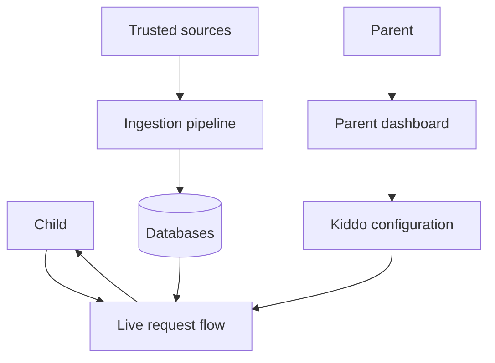
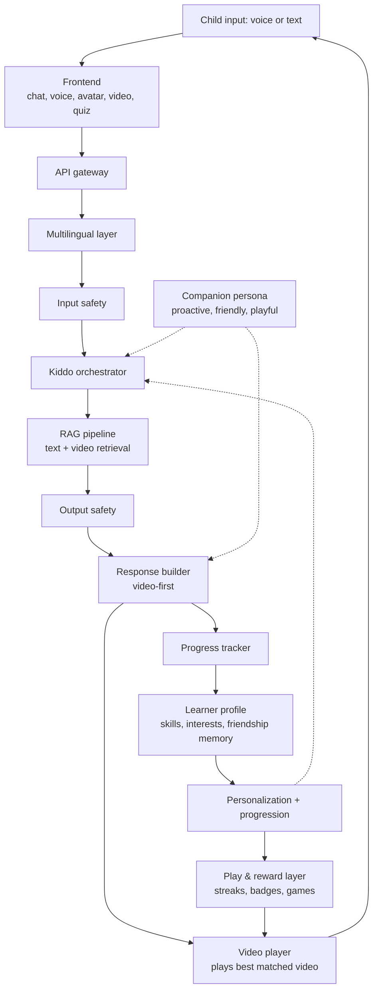
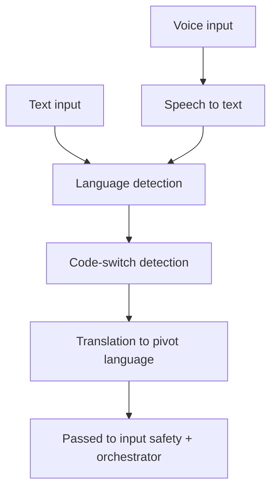
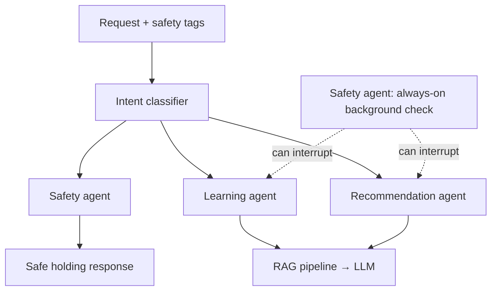
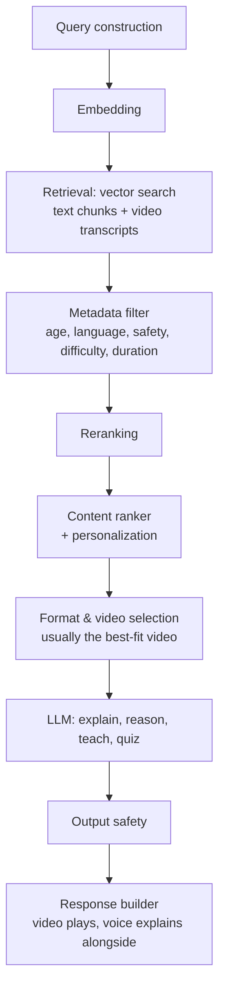
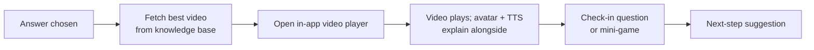
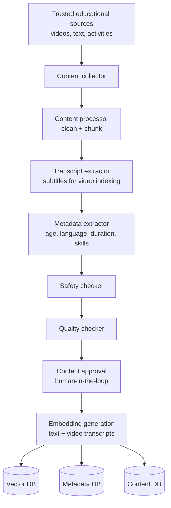
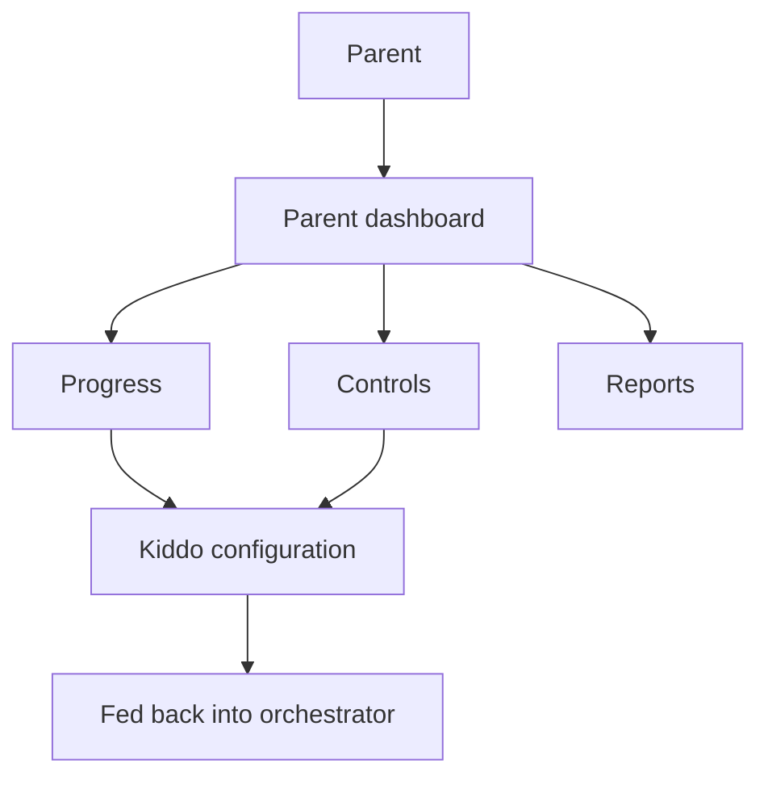

# Kiddo Assist — Architecture Guide

**The core loop (source of truth):** *the child speaks → Kiddo Assist fetches the best video from the knowledge base → it plays on this platform → Kiddo Assist speaks as a friend and guide.* Everything in this design serves that loop. Product name: **Kiddo Assist** (SOT-14).

This document walks through the full system: how a child's question turns into a safe, personalized answer, how content gets into the system in the first place, and how parents stay in the loop.

---

## 1. Overview — the big picture

At a high level, there are three separate systems that work together:

1. **Live request flow** — what happens in real time when a child asks something
2. **Content ingestion pipeline** — an offline process that builds the knowledge base
3. **Parent system** — a separate dashboard that monitors and configures the child's experience

A fourth thread runs through all of this: **Kiddo Assist the companion**. Kiddo Assist is not just an answer box — a warm, always-on friend persona with a memory of each child, who speaks proactively, celebrates wins, and turns learning into playful fun. The rest of this document goes through each system in order.

---

## 2. Live request flow

This is the path a single question takes, from the moment a child speaks or types, to the moment they get an answer back.

### 2.1 Frontend
React/Next.js app handling chat, voice recording, an animated avatar, video playback, and quiz/game UI. This is the only layer the child directly sees.

### 2.2 API gateway
FastAPI service that authenticates the session, routes requests, applies rate limiting, and logs traffic (useful later for parent reports).

### 2.3 Multilingual layer (extension EXT-02 — ships after the core loop)
Handles anything language-related before the question reaches the "thinking" part of the system.

| Step | What it does | Why it matters for kids |
|---|---|---|
| Speech-to-text | Transcribes spoken audio to text | Needs tuning for child speech patterns, not adult voices |
| Language detection | Identifies the input language | Short child sentences give little signal — often needs conversation history/profile as a hint |
| Code-switch detection | Flags when two languages are mixed mid-sentence | Common in multilingual households (e.g. English + Hindi in one sentence) |
| Translation (in) | Normalizes to one pivot language | Keeps the rest of the system language-agnostic — one content index, one set of prompts |
| Translation (out) + TTS | Converts the final answer back to the child's language and voice | Needs a warm, slower, child-friendly voice — not a generic adult TTS voice |

### 2.4 Input safety
Runs before anything reaches the orchestrator. Covers more than a typical chat app because the user is a child.

- **Content checks**: profanity, self-harm or distress signals, bullying language, off-topic/adult requests, jailbreak attempts
- **Privacy checks**: detects and redacts PII (name, address, school, phone number)
- **Intent classification**: learning question vs. play request vs. concerning input — this determines routing downstream

Flags don't necessarily mean "block." Severe signals (self-harm, abuse indicators) should hard-stop and escalate; ambiguous ones can soft-tag the request while it proceeds normally.

### 2.5 Kiddo orchestrator

The central decision-maker. It routes each request to one of three agents, while a safety check runs continuously in the background.

- **Learning agent** — direct questions ("why is the sky blue?")
- **Recommendation agent** — "what should I do next?" or idle moments
- **Safety agent** — distress/harmful/off-topic signals; also runs in parallel on every turn and can interrupt the other two mid-response if something concerning appears

### 2.6 RAG pipeline + content ranking

Once the orchestrator hands off a query, it goes through retrieval, filtering, and ranking before the LLM ever sees it.

| Step | What it does |
|---|---|
| Query construction | Rewrites the child's loose phrasing into a search-friendly query, resolving context like "what about that one" |
| Embedding | Converts the query into a vector capturing meaning, not just keywords |
| Retrieval | Semantic search against the Vector DB for the top-K similar content chunks **and video transcripts** |
| Metadata filter | Hard filters on age range, language, safety clearance, difficulty level, and max duration |
| Reranking | Reorders survivors by true relevance and content quality |
| Content ranker | Adds personalization — this specific child's history and interests |
| Format & video selection | Chooses the strongest deliverable — usually a single best-fit video (relevance, quality, age-fit) to play in the player; the response also returns a ranked **`suggested_videos[]`** (next 2–4 best videos, SOT-05). Otherwise text, quiz, or game |
| LLM | Generates the spoken explanation that runs alongside the video — or the quiz/activity when a video isn't the best fit |
| Output safety | Re-checks the generated response before it goes out |

**Backing databases:**
- **Vector DB** — embeddings, semantic search
- **Metadata DB** — age, language, safety tags, difficulty
- **Content DB** — actual lessons, videos, quizzes, activities

### 2.7 Response delivery and personalization loop

The response builder assembles the final answer. Because Kiddo is **video-first**, the common flow is to play the best-matched video right on the platform, with the avatar speaking around it:

If no strong video match exists, Kiddo falls back to a spoken explanation with a quiz instead.

This loop also feeds:

- **Progress tracker** — logs completed lessons, video watch time, quiz scores
- **Learner profile** — age, language, skill level, interests, history, friendship memory
- **Personalization** — feeds back into the recommendation agent and content ranker

### 2.8 Kiddo Assist companion persona (the friend)

Kiddo Assist is a friend, not a search box. This layer shapes *how* everything is said, not just what is said.

- **Speaks first** — greets the child, checks in, and nudges gently after idle time instead of waiting to be asked
- **Speaks always** — after voice ships, every child-visible turn has a spoken line (SOT-15); silence is a bug
- **Warm, patient, age-tuned** — simpler words and shorter answers for younger children, never condescending
- **Friendship memory** — remembers names, favorite animals and colors, pets, birthdays, and recent wins; references them naturally ("You told me about your dog — let's learn about animal sounds!")
- **Celebrates wins** — praise after quizzes, stickers for effort, not just correct answers
- **Trust is used for learning, never compliance** — the friend persona encourages curiosity but the safety layer (2.4) still rules; the persona never talks a child into an unsafe action

### 2.9 Play & fun learning layer

The "fun" in the problem statement is a designed layer, not a decoration:

- **Streaks & badges** — daily-learning streaks, milestone badges, and unlockable avatar accessories
- **Lessons as quests** — learning units framed as adventures/quests with progress maps
- **Mini-games** — matching, word games, and quizzes delivered as games between lessons
- **Learn-through-play** — content tuned so the game teaches, not just rewards (facts appear as the game is played)
- **Gentle pacing** — streaks are forgiving (a missed day doesn't wipe progress) and suited to each age band

### 2.10 Learning growth progression

The promise is to "help them grow," so Kiddo tracks growth over time:

- **Skill graph** — every video/activity is tagged to skills, and skills link into a learning path
- **Mastery, not just views** — understanding is checked with embedded questions, so "watched" and "understood" are different signals
- **Next-step guidance** — the recommendation agent becomes a progression guide: "you nailed fractions, let's try decimals soon"
- **Parent visibility** — the same signals feed the parent dashboard reports (section 4)

---

## 3. Content ingestion pipeline (offline)

**Content types:** `video`, `source`, `tutorial`, `game`. A `tutorial` is a first-class, ordered sequence that teaches one topic end-to-end (steps 1…N, each step a video or activity); it must have a start, a middle, an end, a skill, and a check-for-understanding. A single orphan clip is **not** a tutorial — the completeness gate at ingest enforces this.

This runs separately from the live flow to build and maintain the knowledge base.

| Step | What it does |
|---|---|
| Content collector | Pulls raw material — videos, text, activities — from trusted educational sources |
| Content processor | Cleans, chunks, and normalizes text; extracts transcripts and subtitles from videos |
| Metadata extractor | Tags age range, language, topic, difficulty, duration, and linked skills |
| Safety checker | Automated (and ideally human) review for child-safety |
| Quality checker | Checks pedagogical accuracy and quality |
| Content approval | Human gate before anything goes live |
| Embedding generation | Creates vectors for text AND video transcripts, writes to all three databases |

---

## 4. Parent system (extension EXT-01 — ships after the core loop)

A separate authenticated area for parents, disconnected from the child's live flow except through configuration.

- **Progress** — pulls from the learner profile and progress logs
- **Controls** — content restrictions, screen time limits, language settings
- **Reports** — periodic summaries: what was learned, quiz performance, any safety flags raised
- **Kiddo configuration** — the settings that actually change how the orchestrator behaves for this child (restricted topics, session length, etc.)

---

## 5. Suggested build order

If starting from scratch, roughly in this order. Note: the product is **not Kiddo Assist until step 4 — the video loop — works**; `WORKFLOW.md` §12 is the hard gate, and steps 1–3 are scaffolding toward it.

1. Frontend chat + API gateway (basic text-only loop)
2. Content DB + simple RAG (no multilingual yet)
3. LLM integration + output safety
4. Video selection + in-app player (video-first core loop)
5. Input safety + safety agent
6. Multilingual layer (STT/TTS/translation)
7. Companion persona + friendship memory
8. Play layer: streaks, badges, mini-games
9. Progression: skills, mastery, next-step suggestions
10. Recommendation agent + learner profile + personalization
11. Parent dashboard
12. Full ingestion pipeline with human review gate

---

## 6. Open questions worth deciding early

- **~~Pivot language~~** **Resolved:** English (locked with the product owner — `IMPLEMENTATION-GUIDE.md` §1, `WORKFLOW.md` §14.1).
- **Safety threshold**: hard block vs. soft-tag-and-monitor for ambiguous distress signals?
- **~~Filter order~~** **Resolved:** filter-before-retrieval while the catalog is small (`IMPLEMENTATION-GUIDE.md` §6.6).
- **~~Escalation path~~** **Resolved:** `safety_events` written immediately + parent webhook, and the child hears a safe holding line with a trusted-adult prompt (`WORKFLOW.md` §14.1).
- **Video relevance bar**: when is a video "good enough" to play vs. falling back to a spoken answer? Who sets the "best videos" quality bar?
- **Gamification limits**: how much reward scaffolding is healthy per age band, and how are streaks/badges kept from feeling punishing if a child misses days?
- **Companion depth**: how "social" should Kiddo's memory get, and where does the friendship-memory boundary sit so warmth never tips into overreach?
- **Progression standards**: which curriculum/learning standards (if any) should the skill graph align to?

---

## Appendix A — Open-source technology stack (reference)

Maps each architecture component to a concrete, free, open-source tool. Full build/run instructions and data model live in `IMPLEMENTATION-GUIDE.md`.

| Architecture component | Tool | Licence |
|---|---|---|
| Frontend | Next.js (React) | MIT |
| API gateway | FastAPI | MIT |
| Speech-to-text | faster-whisper (multilingual `small`, INT8) | MIT |
| Language + code-switch detection | fastText `lid.176` + script heuristics | BSD |
| Pivot translation (→ English) | Helsinki OPUS-MT (`mul-en` / `en-mul`) | CC-BY 4.0 |
| Embeddings | BAAI/bge-m3 | MIT |
| Vector DB + hybrid search | LanceDB | Apache-2.0 |
| Reranking | BAAI/bge-reranker | MIT |
| LLM (chat + teach) | Gemma 4 / Gemma 3 quantized, via Ollama | Open weights (free) |
| Input / output safety | ShieldGemma safety classifier | Open weights |
| TTS (voice) | Kokoro | Apache-2.0 |
| Video delivery | Stream-by-reference from openly-licensed sources | n/a |
| Learner profile / progress | SQLite | MIT / public-domain |
| Parent auth | Auth.js (NextAuth) | MIT |
| Deployment | Docker Compose + Ollama | Apache-2.0 / MIT |

**Resolved decisions** (locked with the product owner): pivot language → **English** (§6 Q1); runtime target → **CPU-only laptop**, small quantized models; video strategy → **stream-by-reference** from openly-licensed catalogs; localization → English pivot with translated answers + TTS back in the child's language.

Everything above runs locally with **$0/month** service cost. ⚠️ The one known weak spot is child-speech recognition — mitigation is a fine-tune on open child-speech datasets (see `IMPLEMENTATION-GUIDE.md` §12).
